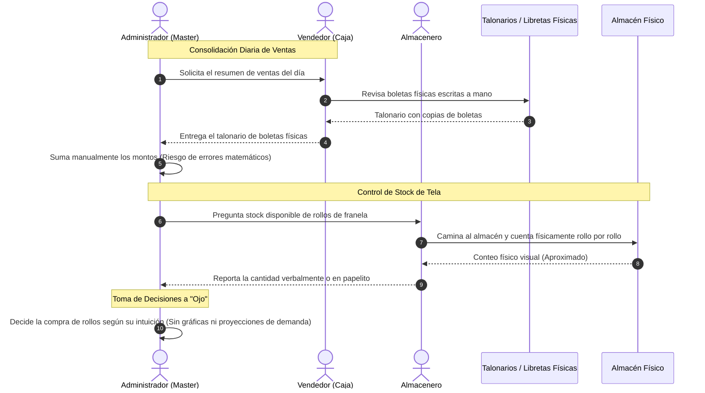
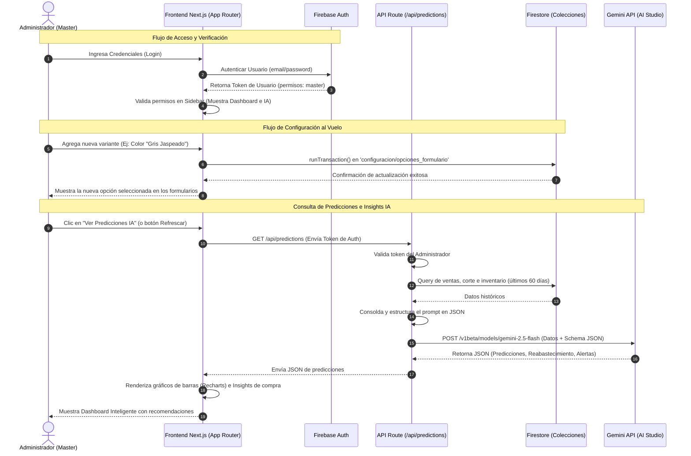
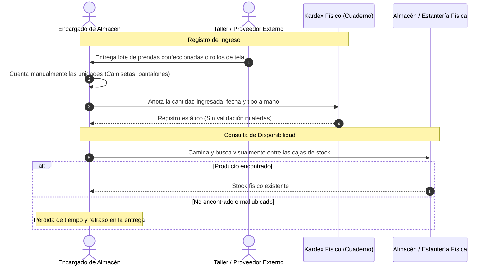
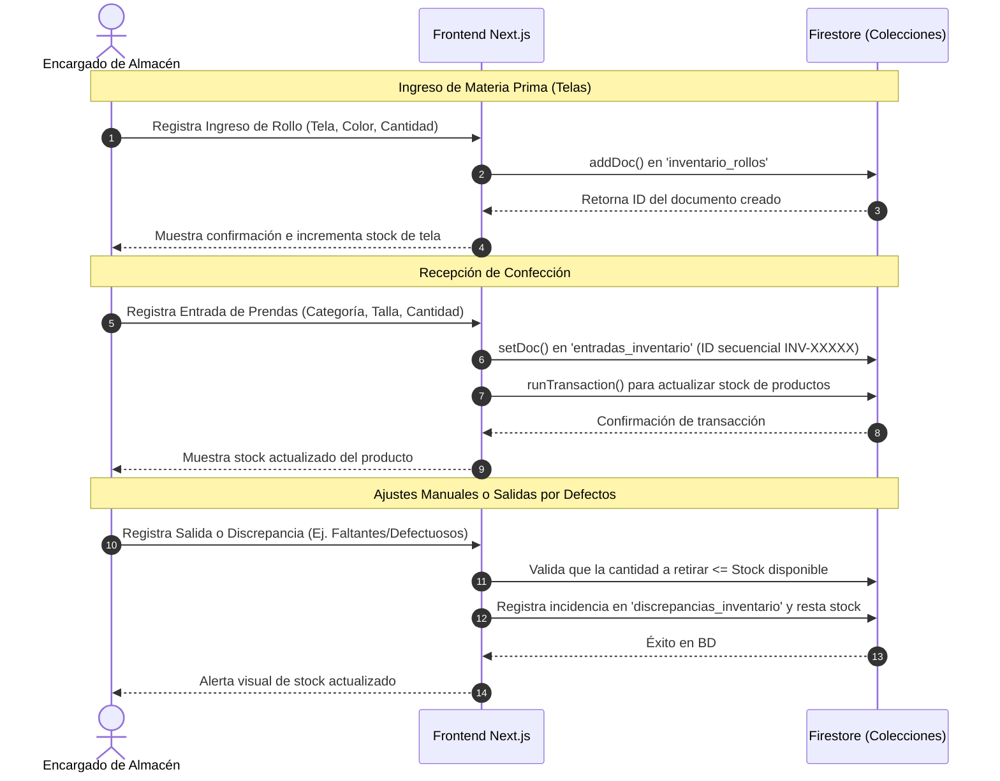
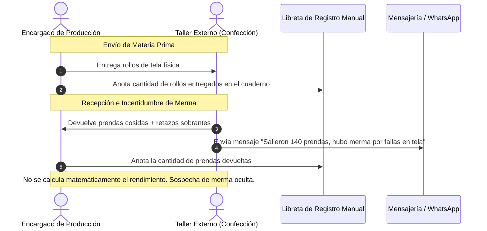
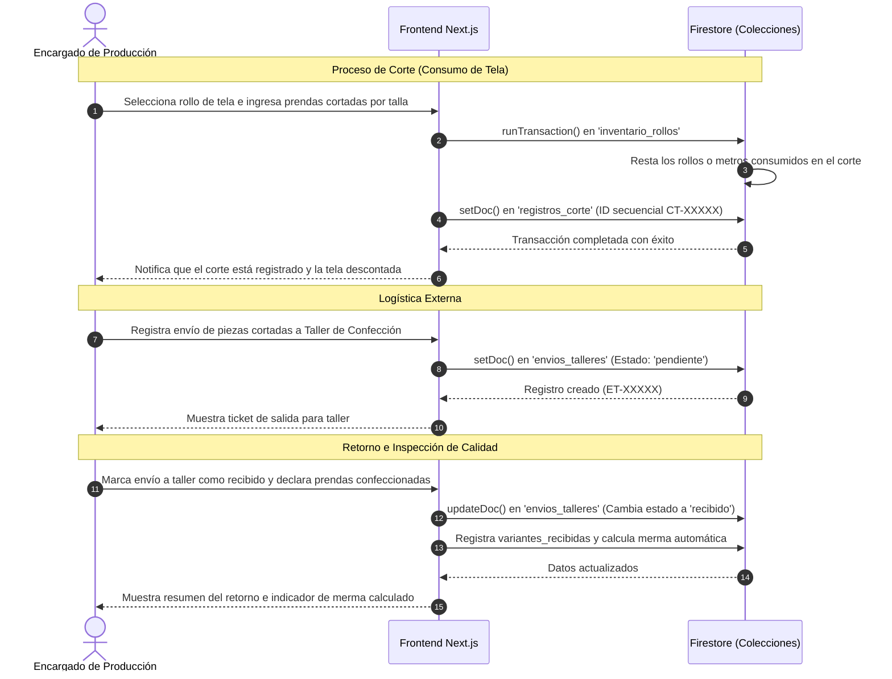
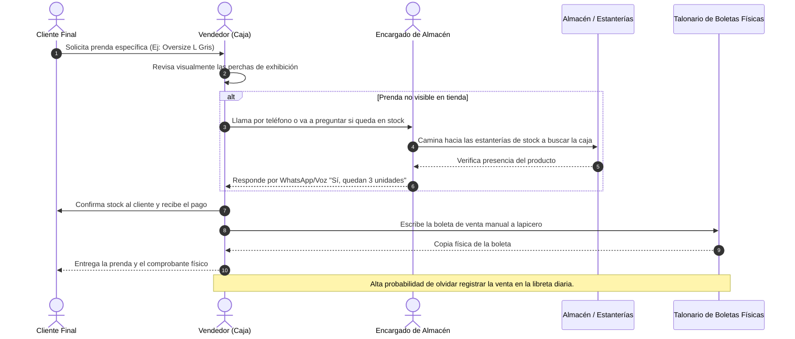
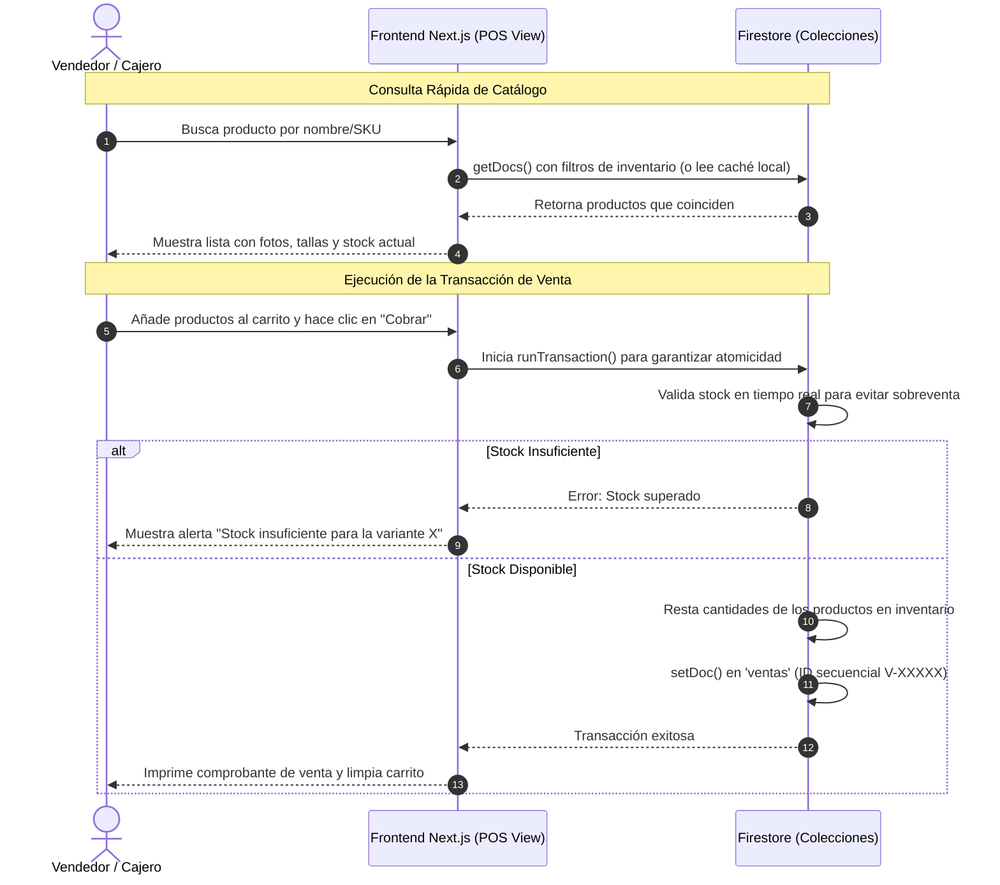

# Diagramas de Secuencia por Roles: Antes vs. Después (Jotape ERP)

Este documento presenta una comparativa visual de los flujos de trabajo de Distribuidor Textil Jotape E.I.R.L. Muestra la diferencia radical entre el **Proceso Anterior (Lápiz, Papel y WhatsApp)** y el **Proceso Nuevo (Automatizado con Jotape ERP)** para cada uno de los roles clave de la empresa.

---

## 1. Rol: Administrador Gerencial / Gerente (Master)
El Administrador supervisa la empresa, configura el catálogo y toma decisiones de abastecimiento de materia prima.

### A) Proceso Anterior (Lápiz, Papel y WhatsApp)
El Administrador dependía de consolidaciones manuales al final del día y de conteos presenciales en almacén para saber el estado de la empresa.

### B) Proceso Nuevo (Con Jotape ERP)
El Administrador tiene visibilidad total, configura variantes al vuelo y cuenta con reportes predictivos con Inteligencia Artificial.

---

## 2. Rol: Encargado de Almacén (Inventario)
El Almacenero recibe mercancía de los talleres de costura y despacha productos terminados o materia prima.

### A) Proceso Anterior (Lápiz, Papel y WhatsApp)
Los registros eran manuscritos en un cuaderno (Kardex físico), propenso a pérdidas, borrones y sin sincronización con la caja de ventas.

### B) Proceso Nuevo (Con Jotape ERP)
El Almacenero registra transacciones digitales instantáneas con IDs secuenciales seguros, actualizando el stock global en tiempo real.

---

## 3. Rol: Encargado de Producción (Corte, Costura y Talleres)
Este rol coordina a los talleres externos de confección, administrando el envío de rollos y el retorno de prendas confeccionadas.

### A) Proceso Anterior (Lápiz, Papel y WhatsApp)
El seguimiento logístico era sumamente informal. Las mermas no se calculaban con exactitud matemática y los tiempos de retorno dependían de llamadas y mensajes de WhatsApp.

### B) Proceso Nuevo (Con Jotape ERP)
Toda la cadena está enlazada. Al recibir prendas se marca el lote como `recibido` y el ERP calcula de inmediato el porcentaje de merma frente a lo enviado, alertando discrepancias.

---

## 4. Rol: Vendedor / Cajero (Punto de Venta)
El Vendedor atiende al público en tienda y cobra las ventas del día.

### A) Proceso Anterior (Lápiz, Papel y WhatsApp)
El vendedor no tenía visibilidad del stock en almacén, teniendo que verificar físicamente en los estantes o preguntar al almacenero, lo que demoraba la atención al cliente.

### B) Proceso Nuevo (Con Jotape ERP)
El Vendedor tiene un buscador ágil, valida stock al instante, y el sistema realiza transacciones atómicas seguras disminuyendo el stock en milisegundos.

