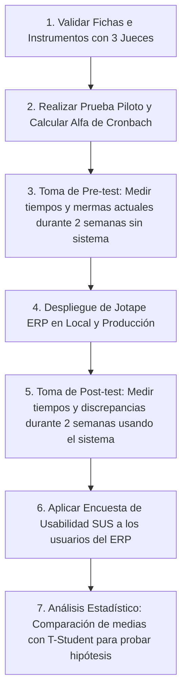

# Diseño Metodológico, Matrices e Instrumentos de Medición - Jotape ERP

Este documento establece el marco metodológico y de validación científica para evaluar la influencia de **Jotape ERP** (Sistema ERP web y módulo inteligente de IA) sobre la eficiencia operativa de la empresa.

---

## 1. Matriz de Consistencia

La Matriz de Consistencia asegura la coherencia lógica entre la formulación del problema, los objetivos de investigación, las hipótesis, las variables de estudio y la metodología aplicada.

| Elemento | General | Específico 1 (Inventarios) | Específico 2 (Logística/Talleres) | Específico 3 (Ventas) |
| :--- | :--- | :--- | :--- | :--- |
| **Problema** | ¿De qué manera la implementación de un sistema ERP web influye en la eficiencia de la gestión operativa en el Distribuidor Textil Jotape E.I.R.L.? | ¿De qué manera el módulo de inventarios del ERP influye en la precisión del stock y la reducción de discrepancias de materia prima? | ¿De qué manera el módulo de trazabilidad y cálculo de mermas influye en la coordinación logística con los talleres externos? | ¿De qué manera el módulo de ventas dinámico influye en el tiempo de procesamiento de ventas y prevención de quiebres de stock? |
| **Objetivo** | Determinar la influencia del sistema ERP web en la eficiencia de la gestión operativa del Distribuidor Textil Jotape E.I.R.L. | Evaluar el impacto del módulo de inventario en la precisión del recuento de existencias y control de materia prima (rollos). | Medir la influencia del módulo de envíos y retornos en el control de tiempos de ciclo (Lead Time) y registro de mermas de talleres. | Analizar el impacto del panel de ventas y las sugerencias de la IA en la velocidad de atención y disponibilidad de stock. |
| **Hipótesis** | La implementación de un sistema ERP web mejora significativamente la eficiencia de la gestión operativa en el Distribuidor Textil Jotape E.I.R.L. | El módulo de inventario reduce significativamente el porcentaje de discrepancia física en el almacén de rollos de tela y productos. | El módulo de trazabilidad permite estandarizar el cálculo de mermas y optimizar los tiempos de retorno desde los talleres de costura. | El panel de ventas rápido reduce el tiempo de atención al cliente y disminuye los quiebres de stock mediante alertas preventivas. |
| **Variables** | **V.I:** Sistema ERP Web (con IA) **V.D:** Eficiencia de la Gestión Operativa | **V.I:** Módulo de Inventario Maestro **V.D:** Precisión del Stock | **V.I:** Módulo de Envíos y Retorno de Talleres **V.D:** Control Logístico y Merma | **V.I:** POS y Módulo Predictivo de Ventas **V.D:** Tiempo de Atención y Quiebre Stock |
| **Metodología** | **Tipo:** Aplicada (Desarrollo tecnológico). **Enfoque:** Cuantitativo. **Diseño:** Pre-experimental (Pre-test y Post-test). **Población:** Transacciones logísticas y comerciales registradas durante 60 días. **Muestra:** Muestreo no probabilístico por conveniencia (últimos 30 días previos y posteriores). |

---

## 2. Matriz de Operacionalización de Variables

Define conceptual y operacionalmente las variables del proyecto, desglosándolas en dimensiones, indicadores y los ítems/instrumentos de medición correspondientes.

### Variable Independiente (V.I.): Sistema ERP Web (con Módulo Predictivo)
*   **Definición Conceptual:** Sistema de planificación de recursos empresariales basado en la nube (Next.js y Firebase) con lógica de transacciones en tiempo real e integración con inteligencia artificial predictiva (Gemini API) para la toma de decisiones.
*   **Definición Operacional:** Grado de implementación, disponibilidad del sistema, velocidad de respuesta de base de datos y nivel de usabilidad de la interfaz medido a través de pruebas de sistema y la escala estandarizada SUS.

| Dimensiones | Indicadores | Unidad de Medida / Fórmula | Instrumento / Ítem |
| :--- | :--- | :--- | :--- |
| **Funcionalidad** | Tasa de éxito transaccional | (Transacciones exitosas / Total de intentos) * 100 | Ficha de registro del sistema (Ficha 1) |
| **Rendimiento** | Tiempo de respuesta del servidor | Segundos (desde petición hasta renderizado del UI) | Logs de Firebase / Consola de desarrollo |
| **Usabilidad** | Nivel de facilidad de uso | Puntaje en la escala System Usability Scale (SUS) | Encuesta de Usabilidad (Instrumento A: Ítems 1-10) |

---

### Variable Dependiente (V.D.): Eficiencia de la Gestión Operativa
*   **Definición Conceptual:** La capacidad de optimizar el uso de los recursos de la empresa (tiempo, inventario físico, tela y dinero) minimizando pérdidas (mermas), duplicidad de registros y retrasos logísticos en el flujo comercial.
*   **Definición Operacional:** Medida cuantitativamente pre y post-implementación a través de métricas de precisión de stock, Lead Times de talleres, tasa de quiebres de stock y tiempos de atención a clientes.

| Dimensiones | Indicadores | Unidad de Medida / Fórmula | Instrumento / Ítem |
| :--- | :--- | :--- | :--- |
| **Control de Inventarios** | Tasa de discrepancia física | (Unidades faltantes/sobrantes / Stock teórico) * 100 | Ficha de Auditoría de Stock (Ficha 2) |
| | Tiempo de registro de stock | Minutos promedio desde que llega el material hasta su registro | Ficha de Trazabilidad Temporal (Ficha 3) |
| **Logística de Confección** | Lead Time de Taller | Días promedio (Fecha recepción - Fecha envío) | Ficha de Registro de Talleres (Ficha 4) |
| | Tasa de merma no declarada | (Merma real - Merma estimada) / Peso original | Ficha de Registro de Talleres (Ficha 4) |
| **Gestión de Ventas** | Tiempo promedio de atención | Segundos transcurridos para registrar una venta en caja | Ficha de Trazabilidad Temporal (Ficha 3) |
| | Frecuencia de quiebre de stock | Número de ventas perdidas al mes por falta de stock visible | Ficha de Registro de Ventas Perdidas |

---

## 3. Instrumentos de Medición (Plantillas)

### Instrumento A: Cuestionario de Usabilidad del Sistema (Escala SUS)
*Dirigido a: Vendedores, Administradores y Jefes de Taller que operan el sistema.*
*Escala Likert: 1 (Totalmente en desacuerdo) a 5 (Totalmente de acuerdo).*

1. Creo que me gustará usar este sistema frecuentemente.
2. Encontré el sistema innecesariamente complejo.
3. Pensé que el sistema era fácil de usar.
4. Creo que necesitaría el apoyo de un técnico para poder usar este sistema.
5. Encontré que las funciones en este sistema estaban bien integradas.
6. Pensé que había demasiada inconsistencia en este sistema.
7. Imagino que la mayoría de la gente aprendería a usar este sistema muy rápidamente.
8. Encontré el sistema muy engorroso (incómodo) de usar.
9. Me sentí muy seguro usando el sistema.
10. Necesité aprender muchas cosas antes de poder ponerme en marcha con este sistema.

---

### Ficha de Registro 1: Trazabilidad Operativa y Tiempos (Pre vs Post)
*Ficha de observación directa completada por el investigador para comparar el método anterior (manual/WhatsApp) frente al nuevo sistema.*

| Métrica Evaluada | Método Anterior (Pre-test) | Con Jotape ERP (Post-test) | Diferencia (%) |
| :--- | :--- | :--- | :--- |
| Tiempo para registrar el ingreso de 1 rollo de tela | ______ minutos | ______ minutos | ______ % |
| Tiempo de atención de una venta de 3 productos | ______ segundos | ______ segundos | ______ % |
| Días transcurridos para notar una discrepancia física | ______ días | ______ días | ______ % |
| Tiempo para calcular el % de merma al recibir del taller | ______ minutos | ______ minutos | ______ % |

---

## 4. Validación y Confiabilidad de los Instrumentos

Para asegurar que los datos recolectados sean válidos y confiables en un marco científico/académico, se aplican los siguientes dos procesos:

### A) Validación por Juicio de Expertos
Cada uno de los instrumentos (cuestionario SUS y fichas de registro) debe someterse a la evaluación de **tres (3) expertos** (por ejemplo, Ingenieros de Sistemas, metodólogos o especialistas en logística). Los expertos califican cada ítem bajo tres criterios mediante una plantilla de validación:
*   **Claridad:** El ítem es entendible y la sintaxis es adecuada.
*   **Pertinencia:** El ítem tiene relación directa con la dimensión evaluada.
*   **Relevancia:** El ítem es esencial para medir la variable.

#### Fórmula de Validación (V de Aiken)
Para cuantificar la validez de contenido de cada ítem en base a las opiniones de los jueces, se utiliza el coeficiente **V de Aiken**:

$$V = \frac{S}{n \cdot (c - 1)}$$

Donde:
*   $S = \sum (r_i - l_0)$: Suma de la diferencia entre la nota asignada por cada juez ($r_i$) y la nota mínima posible ($l_0$).
*   $n$: Número de jueces evaluadores.
*   $c$: Número de valores en la escala de calificación (ej. 1 a 5, entonces $c=5$).
*   *Criterio de aprobación:* Un ítem se considera válido si su coeficiente $V \ge 0.80$.

---

### B) Confiabilidad del Instrumento (Alfa de Cronbach)
Para evaluar la consistencia interna del Cuestionario SUS antes de su aplicación final, se realiza una **prueba piloto** con una pequeña muestra (ej. 5 o 10 usuarios de prueba) y se calcula el **coeficiente Alfa de Cronbach ($\alpha$)**:

$$\alpha = \frac{k}{k - 1} \left( 1 - \frac{\sum S_i^2}{S_t^2} \right)$$

Donde:
*   $k$: Número de ítems del instrumento (para el cuestionario SUS, $k = 10$).
*   $S_i^2$: Varianza de las respuestas obtenidas para el ítem $i$.
*   $S_t^2$: Varianza del puntaje total sumado por cada encuestado.
*   *Escala de Confiabilidad:*
    *   $\alpha \ge 0.90$: Confiabilidad Excelente.
    *   $0.80 \le \alpha < 0.90$: Confiabilidad Muy Buena.
    *   $0.70 \le \alpha < 0.80$: Confiabilidad Aceptable (mínimo requerido para aprobar el instrumento).
    *   $\alpha < 0.70$: Baja confiabilidad, el cuestionario debe ser reformulado.

---

## 5. ¿Cómo Realizaríamos Esto en la Práctica? (Ruta de Trabajo)

Para llevar a cabo la investigación y probar la hipótesis, seguiremos este cronograma metodológico:

1.  **Validación de Expertos:** Diseñar una carta de presentación para los 3 ingenieros/jueces metodológicos y entregarles los instrumentos para que calculen el coeficiente V de Aiken.
2.  **Toma de Pre-test (Línea de Base):** Medir a mano o con cronómetro los tiempos que toma actualmente registrar ingresos en Excel y los tiempos que toma calcular las mermas cuando retornan los lotes del taller de costura por WhatsApp.
3.  **Toma de Post-test (Evaluación del ERP):** Tras 2 semanas de uso del sistema Jotape ERP, volver a cronometrar los mismos procesos a través de las fichas de registro para obtener las variables duras cuantitativas.
4.  **Procesamiento:** Introducir los datos del Pre-test y Post-test en una herramienta de análisis estadístico (como SPSS o un script en Python) para realizar una **prueba de hipótesis T de Student para muestras relacionadas**, lo cual validará científicamente si el sistema realmente redujo el tiempo y las mermas de forma significativa.
