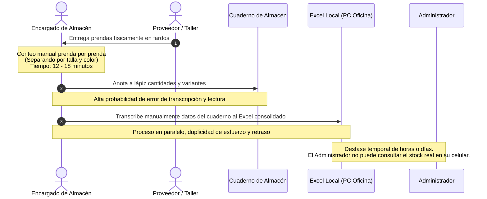
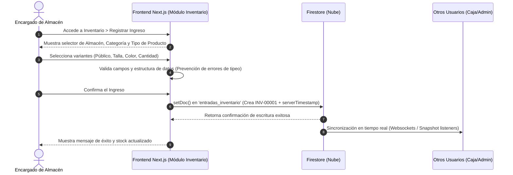
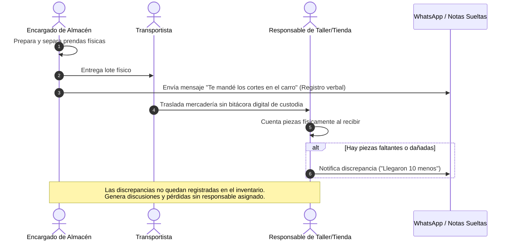
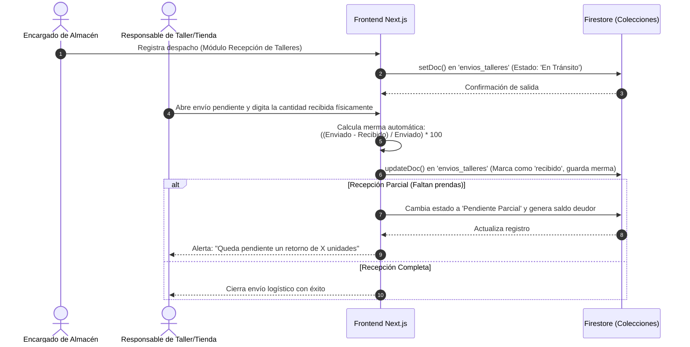
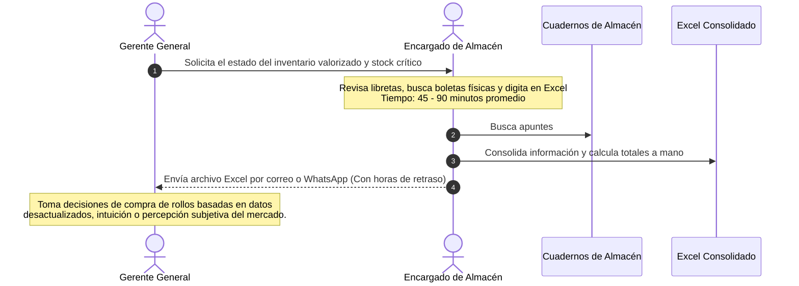
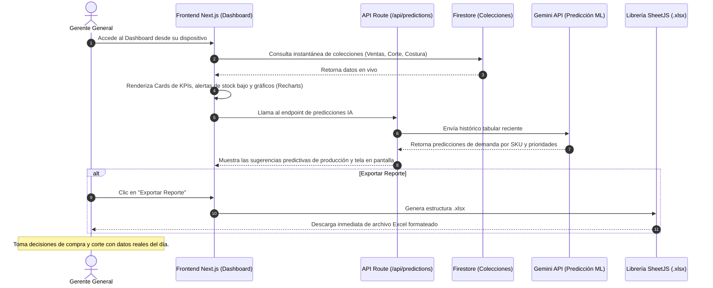

# Diagramas de Secuencia: Procesos Clave de Negocio (Antes vs. Después)

Este documento detalla el comportamiento secuencial de los tres procesos clave del negocio para **Distribuidor Textil Jotape E.I.R.L.**, contrastando la ineficiencia del modelo tradicional con la optimización y trazabilidad provista por el nuevo sistema.

---

## 3.1. Proceso de Registro de Entradas y Salidas de Inventario

### A) ANTES DE LA SOLUCIÓN (Proceso Manual)
*   **Características:** Registro en cuadernos físicos y transcripción manual a Excel sin integración.
*   **Métricas:** Tiempo promedio: **15.2 min/operación**. Tasa de error: **~18.4%**. Sin trazabilidad.

### B) DESPUÉS DE LA SOLUCIÓN (Con Jotape ERP)
*   **Características:** Registro digital centralizado en Firestore con validación en tiempo real.
*   **Métricas:** Tiempo promedio: **3.1 min/operación**. Tasa de error: **< 1%**. Trazabilidad por SKU.

---

## 3.2. Proceso de Traslado Almacén – Talleres y Puntos de Venta

### A) ANTES DE LA SOLUCIÓN (Proceso Manual)
*   **Características:** Despacho verbal por WhatsApp, sin control de retornos ni mermas in situ.
*   **Métricas:** Tasa de pérdidas en traslado: **~12.8%**. Sin responsabilidades definidas.

### B) DESPUÉS DE LA SOLUCIÓN (Con Jotape ERP)
*   **Características:** Flujo de despacho/recepción inmutable con cálculo de mermas y pendientes.
*   **Métricas:** Tasa de pérdidas reducida a **~2.1%**. Trazabilidad total con usuario y timestamp.

---

## 3.3. Proceso de Generación de Reportes y Toma de Decisiones

### A) ANTES DE LA SOLUCIÓN (Proceso Manual)
*   **Características:** Consolidación manual bajo demanda, datos desactualizados y decisiones subjetivas.
*   **Métricas:** Tiempo de generación: **67.3 min**. Decisiones empíricas sin alertas.

### B) DESPUÉS DE LA SOLUCIÓN (Con Jotape ERP)
*   **Características:** Dashboard en tiempo real, predicciones automáticas por IA/ML y exportaciones dinámicas.
*   **Métricas:** Tiempo de generación: **0.8 min**. Alertas automáticas y decisiones basadas en datos.

