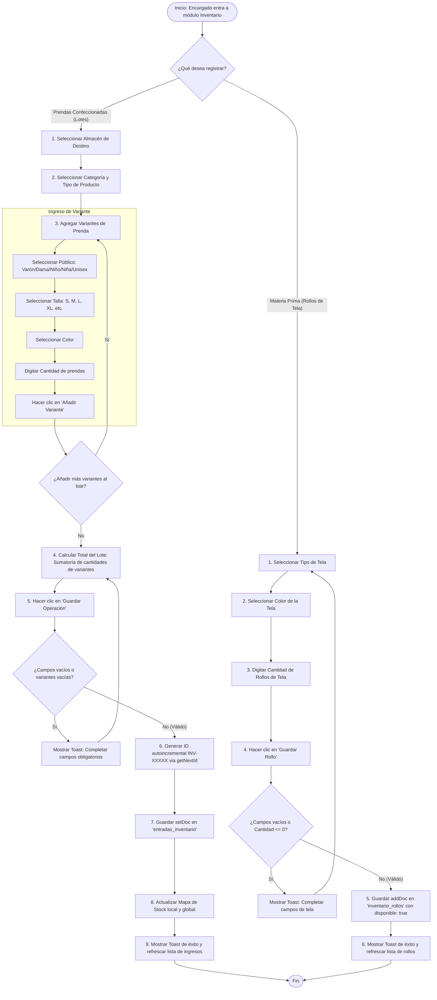
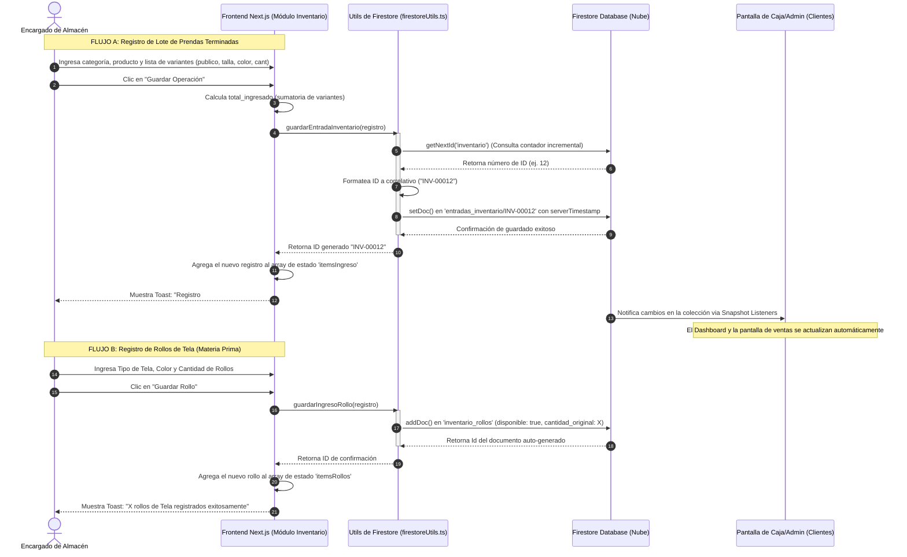

# Flujo de Registro de Inventario (Detallado y Completo)

Este documento detalla el flujo de registro de inventario en **Jotape ERP**, dividiéndose en el flujo para **Prendas Terminadas (Lotes por variantes)** y **Materia Prima (Rollos de Tela)**.

---

## 1. Diagrama de Flujo del Proceso (Flowchart)

El siguiente diagrama de flujo abarca desde que el Encargado de Almacén decide qué registrar, las validaciones frontend, el guardado transaccional en la base de datos Firestore y la propagación de datos.

---

## 2. Diagrama de Secuencia Técnico (Sequence Diagram)

Este diagrama muestra las llamadas de función y la comunicación entre el Cliente (Frontend React/Next.js) y la base de datos Firestore durante el guardado de los dos flujos.

